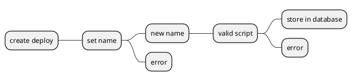
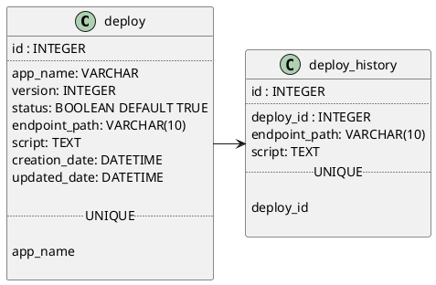

# Deploy Blitz

<!--Writerside adds this topic when you create a new documentation project.
You can use it as a sandbox to play with Writerside features, and remove it from the TOC when you don't need it anymore.-->

## Create Deploy Logic

```mermaid
sequenceDiagram
    Create Deploy -->> Create Webhook: set webhook name
    Create Webhook -->> Upload Script: Verify integrity file sh/yaml
    Upload Script -->> Database: store sh/yaml script
    Database -->> Create Webhook: OK
    Create Webhook -->> Create Deploy: localhost:8080/webhook/{name}
```


### Database Structure

