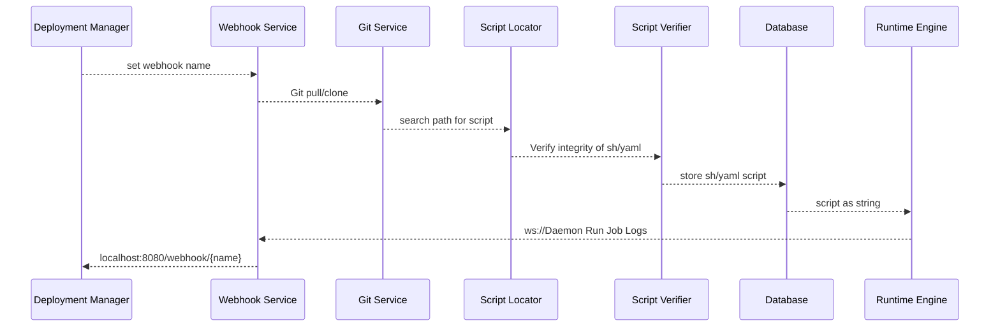
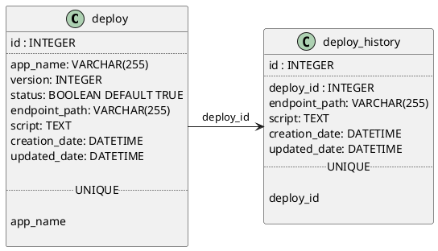

# Deploy Blitz

<!--Writerside adds this topic when you create a new documentation project.
You can use it as a sandbox to play with Writerside features, and remove it from the TOC when you don't need it anymore.-->

## Create Deploy Logic

- [X] Create Deploy
- [x] Create Webool

```plantuml
@startmindmap
* Deployment Manager
    * set webhook name
        * Webhook Service
            * error
            * Git pull/clone
                * Git Service
                    * error
                    * search path for script
                        * Script Locator
                            * error
                            * Verify integrity of sh/yaml
                                * Script Verifier
                                    * error
                                    * store sh/yaml script
                                        * Database
                                            * error
                                            * script as string
                                                * Runtime Engine
                                                    * error
                                                    * ws://Daemon Run Job Logs
                                                        * Webhook Service
                                                            * error
                                                            * localhost:8080/webhook/{name}
                                                                * Deployment Manager
@endmindmap

```

- [x] Git with Token git clone `https://<username>:${GITHUB_TOKEN}@github.com/username/repository.git`

### Database Structure

